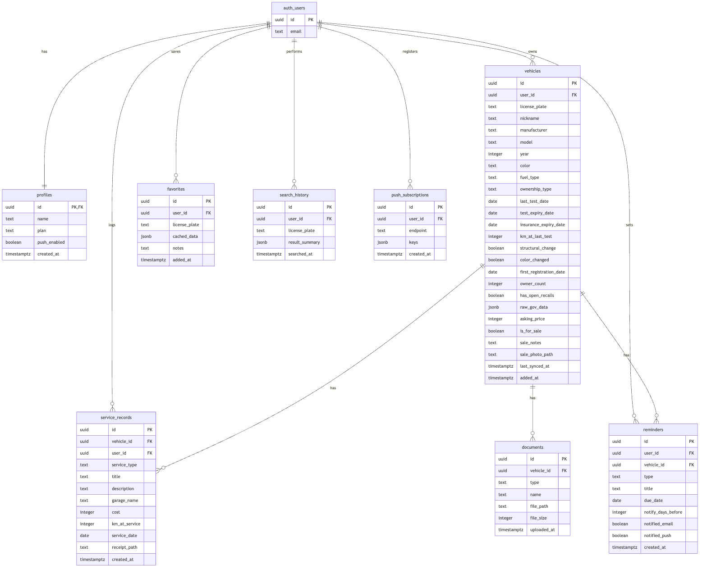

# 🚗 MyCarPortal

> **GitHub:** https://github.com/DaelShloush/MyCarPortal
> **אתר חי (Production):** https://frontend-mycarportal.vercel.app

פלטפורמת ווב ישראלית (PWA) שמרכזת מידע רשמי על רכבים פרטיים בישראל ומאפשרת ניהול רכב אישי — חיפוש לפי מספר רישוי, הערכת שווי ועלויות, ופאנל ניהול עם היסטוריית טיפולים ומסמכים. פרויקט גמר לקורס Full-Stack מונחה-AI, פותח כולו עם Claude Code.

---

## תוכן עניינים

1. [הבעיה והפתרון](#הבעיה-והפתרון)
2. [משתמשים (פרסונות)](#משתמשים-פרסונות)
3. [מתחרים ובידול](#מתחרים-ובידול)
4. [פיצ'רים עיקריים](#פיצרים-עיקריים)
5. [מודל עסקי](#מודל-עסקי)
6. [סטאק טכנולוגי](#סטאק-טכנולוגי)
7. [ארכיטקטורה](#ארכיטקטורה)
8. [מקורות הנתונים — data.gov.il](#מקורות-הנתונים--datagovil)
9. [שירותים חיצוניים ואינטגרציות](#שירותים-חיצוניים-ואינטגרציות)
10. [מבנה בסיס הנתונים](#מבנה-בסיס-הנתונים)
11. [מבנה התיקיות](#מבנה-התיקיות)
12. [הרצה מקומית](#הרצה-מקומית)
13. [משתני סביבה](#משתני-סביבה)
14. [בדיקות](#בדיקות)
15. [פריסה (Deployment)](#פריסה-deployment)
16. [סטטוס שלבי הקורס](#סטטוס-שלבי-הקורס)

---

## הבעיה והפתרון

### הבעיה
1. **רוכשי רכב יד שנייה** מבזבזים שעות על חיפוש ידני באתר משרד התחבורה, ומפחדים מהיסטוריה בעייתית שמתגלה רק מאוחר.
2. **בעלי רכב קיים** מאבדים שליטה על מועדי טסט וביטוח, ומסמכי הרכב פזורים בלי תיעוד מסודר.

### הפתרון
פלטפורמה אחת שעושה שני דברים:
- **חיפוש רכב לפי מספר רישוי** — שולפת אוטומטית את כל הנתונים הרשמיים מ-data.gov.il, מציגה הערכת שווי ועלות אחזקה, ומאפשרת קבלת החלטה מהירה לפני בדיקה פיזית.
- **ניהול רכב אישי** — דשבורד עם מעקב אחר מועדי טסט וביטוח, אחסון מסמכים דיגיטלי, היסטוריית טיפולים, חיפושים ומועדפים.

---

## משתמשים (פרסונות)

- **ראשי — דנה (28, מפתחת תוכנה):** רוכשת רכב יד שנייה, רוצה לסנן רכבים מהר לפני בדיקה פיזית.
- **משני — יצחק (58, מהנדס מכונות):** בעל רכב משפחתי, רוצה לעקוב אחר מועדי טסט וביטוח ולשמור תיעוד מסודר של הרכב.

---

## מתחרים ובידול

היום, מי שרוצה לבדוק רכב לפני קנייה או לנהל את הרכב שלו נעזר באחד מאלה — ולכל אחד יש פער שאנחנו סוגרים:

| פתרון קיים | מה הוא נותן | החיסרון (= ההזדמנות שלנו) |
| --- | --- | --- |
| **חיפוש ידני ב-data.gov.il / אתר משרד התחבורה** | נתונים רשמיים, חינם | מפוזר על פני עשרות מאגרים, ממשק מסורבל, בלי הערכת שווי, בלי TCO ובלי ניהול שוטף |
| **לוחות רכב (יד2 וכו')** | מודעות מכירה | ממוקד במוכר; אין אימות נתונים רשמי ואין ניהול רכב קיים |
| **שירותי "בדיקת עבר רכב" בתשלום** | דוח חד-פעמי | בתשלום, חד-פעמי, מסתיים ברגע הקנייה — לא מלווה אותך לאורך הבעלות |
| **אפליקציות ניהול רכב (Drivvo וכד')** | יומן טיפולים ומעקב | לא מחוברות לנתוני data.gov.il הישראליים; ידני לגמרי |
| **"לעשות ידנית" — אקסל / מעקב בטלפון / תיקיית מסמכים** | גמיש, מוכר | שביר, נשכח, בלי נתונים רשמיים ובלי הערכת שווי |

### הבידול שלנו

- **מאגד הכול במקום אחד** — חיפוש רשמי מ-12 מאגרי data.gov.il **+** הערכת שווי **+** מחשבון עלות אחזקה (TCO) **+** ניהול אישי — מה שהיום מפוזר על־פני 4–5 כלים שונים.
- **חינמי לליבה ובעברית מלאה (RTL)** — בלי לשלם על דוח חד-פעמי ובלי לדלות ידנית ממאגרים ממשלתיים.
- **מלווה לאורך כל הבעלות, לא רק בקנייה** — מעקב אחר מועדי טסט/ביטוח, אחסון מסמכים והיסטוריית טיפולים — מה שלוחות הרכב ושירותי הבדיקה לא נותנים.
- **שקיפות מלאה** — כל חישוב (שווי, פחת, TCO, אמינות דגם) נגזר מהנתונים הרשמיים ומוצג למשתמש, לא "קופסה שחורה".

---

## פיצ'רים עיקריים

### חיפוש ובדיקת רכב (פתוח לכולם)
- **חיפוש לפי מספר רישוי** — עמוד תוצאות יחיד עם כל המידע, מאוחד מ-12 מאגרי data.gov.il
- **תמונת רכב + לוגו יצרן** — render מ-imagin.studio (לפי יצרן/דגם/שנה/צבע) + לוגו אמיתי מ-avto-dev CDN
- **הערכת שווי נוכחי** — מחושב מהמחיר המקורי לפי גיל וקילומטראז'
- **מחשבון עלות אחזקה (TCO)** — אגרת רישוי, צריכת דלק ועלות שנתית/חמש-שנתית
- **פופולריות ואמינות הדגם** — כמה מהדגם פעילים על הכביש, שיעור הישרדות (פעילים מול שירדו מהכביש), ואחוז ירידת ערך
- **פרטים מלאים** — מנוע, מרכב, בעלויות, טסט/רישוי, ריקולים, בטיחות ו-ADAS, פליטות, צמיגים, מספר שלדה (VIN), תג נכה
- **אזהרות סטטוס** — רכב לא פעיל / ירד מהכביש / יבוא אישי
- **השוואת רכבים** — 2 רכבים (חינם) / 4 (פרמיום), כולל הזנת מספר רישוי ישירות מעמוד הרכב
- **דוח PDF** — הדפסה/שמירה של עמוד הרכב
- **שיתוף עשיר** — תגי OpenGraph דינמיים (שם רכב + תמונה) לשיתוף בוואטסאפ/רשתות

### ניהול רכב אישי (דורש הרשמה)
- **דשבורד "הרכבים שלי"** + התראות על טסט/ביטוח מתקרבים
- **מעקב טסט וביטוח** — כל רכב מציג כמה ימים נותרו עד פקיעת הטסט והביטוח, עם הדגשה צבעונית כשמתקרב המועד
- **זיהוי לוחית ב-AI** — צילום לוחית רישוי → זיהוי המספר אוטומטית (Claude Vision)
- **ניהול מסמכים** — העלאה ל-Supabase Storage (רישיון, ביטוח, קבלות)
- **היסטוריית טיפולים** — תיעוד טיפולים, מוסך, עלות וק"מ
- **עדכון ביטוח** (תאריך חידוש + עלות) ורענון נתונים מהמאגר
- **מחולל מודעת מכירה** — יצירת טקסט מודעה אוטומטי
- **מועדפים** + **היסטוריית חיפושים** (אורחים: localStorage · מחוברים: Supabase)

### תשתית
- **PWA** — manifest, service worker, אייקונים, עמוד offline
- **Auth** — Supabase (אימייל + Google OAuth + איפוס סיסמה)
- **נגישות ו-RTL** — עברית מלאה עם Tailwind logical properties

---

## מודל עסקי

Freemium — שדרוג ל-Premium (₪9.90/חודש).

| פיצ'ר | חינם | פרמיום |
| --- | --- | --- |
| חיפוש רכבים + כל המידע | ✅ ללא הגבלה | ✅ ללא הגבלה |
| היסטוריית חיפושים | 20 אחרונים | ללא הגבלה |
| מועדפים | עד 5 | ללא הגבלה |
| ניהול רכבים | 1 רכב | עד 3 |
| מסמכים לרכב | עד 5 | ללא הגבלה |
| השוואת רכבים | עד 2 | עד 4 |
| הפקת PDF | ✅ | ✅ |

> **הערה:** בגרסה הנוכחית השדרוג ל-Premium הוא **מיידי וללא תשלום אמיתי (מצב דמו)** — לחיצה על "שדרג" הופכת את המשתמש ל-premium ופותחת את כל הפיצ'רים. אינטגרציית סליקה (Paddle/Stripe) מתוכננת לעתיד.

---

## סטאק טכנולוגי

| רכיב | טכנולוגיה |
| --- | --- |
| Framework | Next.js 16.2.4 (App Router) + TypeScript |
| Styling | Tailwind CSS v4 (logical properties, RTL) |
| Auth + DB | Supabase (PostgreSQL + RLS) |
| Storage | Supabase Storage (מסמכים) |
| OCR / AI | Anthropic Claude (Vision) — זיהוי לוחית |
| תמונות רכב | imagin.studio CGI API |
| לוגו יצרנים | avto-dev/vehicle-logotypes (vl.imgix.net) |
| API חיצוני | data.gov.il (CKAN) — חינמי, ללא מפתח |
| Hosting | Vercel |
| Analytics | Vercel Analytics + Speed Insights |
| בדיקות | Vitest |

---

## ארכיטקטורה

```
דפדפן (PWA)
    │
    ▼
Vercel CDN / Edge
    │
    ├── Static assets (JS/CSS/images) — נשמרים ב-CDN
    │
    └── Next.js Server (App Router, RSC + Server Actions)
            │
            ├── /api/vehicle/[plate] ─► data.gov.il (CKAN) — קריאות מקבילות
            ├── /api/ocr ─► Claude Vision (זיהוי לוחית, מגודר בעלות)
            │
            └── Server Actions / RSC ─► Supabase (Auth · PostgreSQL + RLS · Storage)
```

**עקרונות:** הקליינט לא פונה ישירות ל-data.gov.il (proxy דרך השרת); כל גישת DB מוגנת ב-RLS (`auth.uid() = user_id`); `proxy.ts` (middleware) מרענן את ה-session, וההגנה על עמודים מתבצעת ברמת העמוד.

---

## מקורות הנתונים — data.gov.il

כל הקריאות ל-`https://data.gov.il/api/3/action/datastore_search`. בכל חיפוש מתבצעות 8 קריאות מקבילות + 4 תלויות (לפי קודי יצרן/דגם):

| מטרה | Resource ID |
| --- | --- |
| רכבים פעילים (ראשי) | `053cea08-09bc-40ec-8f7a-156f0677aff3` |
| רכבים פעילים (צמיגים/גרירה) | `0866573c-40cd-4ca8-91d2-9dd2d7a492e5` |
| היסטוריית בעלויות | `bb2355dc-9ec7-4f06-9c3f-3344672171da` |
| היסטוריה טכנית (ק"מ, שינויים) | `56063a99-8a3e-4ff4-912e-5966c0279bad` |
| מפרט דגמים (90 שדות) | `142afde2-6228-49f9-8a29-9b6c3a0cbe40` |
| ריקולים פתוחים | `36bf1404-0be4-49d2-82dc-2f1ead4a8b93` |
| מחירון יבואנים | `39f455bf-6db0-4926-859d-017f34eacbcb` |
| כמויות לפי דגם (פופולריות) | `5e87a7a1-2f6f-41c1-8aec-7216d52a6cf6` |
| רכבים לא פעילים | `f6efe89a-fb3d-43a4-bb61-9bf12a9b9099` |
| ביטול סופי (גריטה) | `851ecab1-0622-4dbe-a6c7-f950cf82abf9` |
| יבוא אישי | `03adc637-b6fe-402b-9937-7c3d3afc9140` |
| תג נכה | `c8b9f9c8-4612-4068-934f-d4acd2e3c06e` |

**מגבלות ידועות:** אין היסטוריית תאונות, אין פרטי בעלים (חוק פרטיות), היסטוריית בעלויות זמינה מ-2017+, ה-endpoint של SQL חסום.

---

## שירותים חיצוניים ואינטגרציות

המוצר נשען על השירותים החיצוניים הבאים:

| שירות | סוג | תפקיד במוצר |
| --- | --- | --- |
| **Supabase Auth** | אוטנטיקציה | הרשמה והתחברות משתמשים — אימייל+סיסמה, איפוס סיסמה, וניהול ה-session |
| **Google OAuth** | אוטנטיקציה | התחברות בלחיצה דרך חשבון Google (מסופק דרך Supabase Auth) |
| **Supabase PostgreSQL** | בסיס נתונים | אחסון כל נתוני המשתמש (רכבים, טיפולים, מסמכים, מועדפים) — מאובטח ב-Row Level Security |
| **Supabase Storage** | אחסון קבצים | שמירת מסמכי רכב ותמונות מודעות מכירה, עם policies לפי תיקיית המשתמש |
| **data.gov.il (CKAN API)** | API חיצוני | שליפת נתוני הרכב הרשמיים מ-12 מאגרים ממשלתיים (חינמי, ללא מפתח) — נקרא דרך השרת, לא מהקליינט |
| **Anthropic Claude (Haiku Vision)** | AI / API חיצוני | זיהוי מספר לוחית מתמונה (OCR) — אופציונלי, מגודר בעלות |
| **imagin.studio (CGI API)** | API חיצוני | render תמונת רכב דינמית לפי יצרן/דגם/שנה/צבע |
| **Wikipedia / Wikimedia** | API חיצוני | צילום דגם אמיתי כ-fallback כשאין render ב-imagin |
| **avto-dev vehicle-logotypes** | API / CDN | לוגו יצרן אמיתי (vl.imgix.net) |
| **Vercel** | אירוח ודיפלוימנט | הרצת אפליקציית Next.js בפרודקשן (CDN + Edge + Server) |
| **Vercel Analytics + Speed Insights** | אנליטיקס | ניטור ביצועים ושימוש |

> **אבטחת מפתחות:** כל המפתחות והסודות (Supabase service role, Anthropic, Google secret) נשמרים כמשתני סביבה בצד השרת בלבד ולעולם לא נחשפים לקליינט. קריאות ל-data.gov.il ול-Claude מתבצעות דרך השרת בלבד.

---

## מבנה בסיס הנתונים

### תרשים ERD



> תרשים מלא של 8 הטבלאות (+ `auth.users` של Supabase), כולל עמודות, טיפוסים, מפתחות ראשיים/זרים (PK/FK) והקשרים. מקור התרשים: [`docs/erd.mmd`](docs/erd.mmd) (Mermaid). הסכמה המלאה עם אילוצים, RLS ואינדקסים: [`docs/DATA-DESIGN.md`](docs/DATA-DESIGN.md).

טבלאות עיקריות ב-Supabase PostgreSQL (כולן עם RLS לפי `user_id`):

- **`profiles`** — פרופיל משתמש + תוכנית (free/premium)
- **`vehicles`** — רכבים בניהול אישי + cache נתוני API
- **`service_records`** — היסטוריית טיפולים
- **`documents`** — מסמכים (path ב-Storage)
- **`favorites`** — מועדפים (snapshot)
- **`search_history`** — היסטוריית חיפושים
- **`push_subscriptions`** — מנויי Push (תשתית עתידית)

**Storage:** bucket פרטי `documents/{user_id}/{vehicle_id}/...` עם policies לפי תיקיית המשתמש.

---

## מבנה התיקיות

```
MyCarPortal/
├── README.md              # המסמך הזה
├── docs/                  # תיעוד מפורט (API, Data, Design, System, Deployment)
└── frontend/              # אפליקציית Next.js
    ├── app/               # App Router — עמודים, layouts, API routes, server actions
    │   ├── page.tsx                 # דף הבית
    │   ├── search/[plate]/          # עמוד תוצאות חיפוש (+ loading ממותג)
    │   ├── compare/                 # השוואת רכבים
    │   ├── dashboard/ favorites/ history/ settings/
    │   ├── vehicle/[id]/            # ניהול רכב אישי
    │   ├── (auth)/                  # התחברות/הרשמה/איפוס סיסמה
    │   ├── api/                     # /vehicle/[plate], /ocr
    │   ├── actions/                 # Server Actions (favorites, vehicle, service, ...)
    │   ├── robots.ts · sitemap.ts · manifest.ts
    │   └── layout.tsx · globals.css
    ├── components/        # ui/ · domain/ · layout/
    ├── lib/               # api/ (data-gov, aggregator) · מחשבונים · validators · types
    │   └── __tests__/     # בדיקות Vitest
    ├── proxy.ts           # middleware (רענון session)
    └── public/            # אייקונים, sw.js, offline.html
```

---

## הרצה מקומית

```bash
cd frontend
npm install

# צור קובץ .env.local (ראה "משתני סביבה")
npm run dev          # http://localhost:3000
```

פקודות נוספות:
```bash
npm run build        # build לפרודקשן
npm test             # הרצת בדיקות (Vitest)
npm run lint         # ESLint
```

---

## משתני סביבה

נדרשים ב-`frontend/.env.local` (ובפרודקשן ב-Vercel):

| משתנה | חובה? | שימוש |
| --- | --- | --- |
| `NEXT_PUBLIC_SUPABASE_URL` | ✅ | חיבור Supabase |
| `NEXT_PUBLIC_SUPABASE_ANON_KEY` | ✅ | חיבור Supabase (client) |
| `GOOGLE_CLIENT_ID` / `GOOGLE_CLIENT_SECRET` | OAuth | התחברות Google (גם ב-Supabase) |
| `SUPABASE_SERVICE_ROLE_KEY` | ל-OCR | מכסה יומית גלובלית לזיהוי לוחית (RPC חוצה-משתמשים) |
| `NEXT_PUBLIC_IMAGIN_CUSTOMER` | אופציונלי | מפתח imagin (ברירת מחדל: demo חינמי) |
| `ANTHROPIC_API_KEY` | ל-OCR | זיהוי לוחית מתמונה (Claude Vision) |
| `NEXT_PUBLIC_OCR_ENABLED` | ל-OCR | `1` כדי להציג את כפתור הסריקה (רק כשהמפתח הוגדר) |

> ⚠️ סודות לעולם לא נשמרים ב-git (`.env*` ב-`.gitignore`).

### זיהוי לוחית (OCR) — הפעלה ובקרת עלות

הפיצ'ר משתמש ב-Claude Haiku Vision (זול: ~0.4 אגורות לסריקה). הוא **כבוי כברירת מחדל**
ומופעל רק כש-`ANTHROPIC_API_KEY` + `NEXT_PUBLIC_OCR_ENABLED=1` מוגדרים. שכבות הגנה מפני
התפרצות עלות: (1) **הגבלת הוצאה ב-Anthropic Console** — התקרה הקשיחה; (2) **מכסה יומית
גלובלית** של 300 סריקות (`bump_ocr_usage` RPC, דורש `supabase/migrations/004_ai_usage.sql`);
(3) **הגבלה לפי IP**; (4) הקטנת תמונה ל-512px בצד הלקוח. ללא המפתח — הכפתור מוסתר והאפליקציה
עובדת רגיל.

---

## בדיקות

מערך בדיקות יחידה עם **Vitest** (`npm test`) — 46 בדיקות המכסות:
- `validators` — ולידציה ופורמט מספרי רישוי
- `value-estimator` — חישוב פחת, רצפת ערך, עונש קילומטראז'
- `manufacturer-logos` — זיהוי slug יצרן (התאמת תחילת-מילה, כולל סיומות מדינה)
- `car-image` — מיפוי modelFamily ל-imagin (C250→c-class וכו')
- `vehicle-score` — חישוב ציון הרכב 0–100 וניכוי לפי דגלי אזהרה
- `gearbox` — תווית תיבת הילוכים מהמפרט

---

## פריסה (Deployment)

- **Hosting:** Vercel (production: https://frontend-mycarportal.vercel.app)
- **DB:** Supabase (eu-west-1)
- פריסה: `cd frontend && npx vercel --prod`
- SEO: `robots.txt`, `sitemap.xml`, נתוני מבנה (JSON-LD schema.org Car), ותגי OpenGraph דינמיים
- ניטור: Vercel Analytics + Speed Insights

---

## סטטוס שלבי הקורס

| שלב | סטטוס |
| --- | --- |
| 1. Ideation | ✅ |
| 2. Research & Requirements | ✅ |
| 3. System Design | ✅ |
| 4. Wireframe | ✅ |
| 5. Design | ✅ |
| 6. Frontend Development | ✅ |
| 7. Data Design | ✅ |
| 8. Backend Development | ✅ |
| 9. Deploy | ✅ |
| 10. Test & Iterate | ✅ |

---

*נבנה בישראל 🇮🇱 · פרויקט גמר Full-Stack מונחה-AI*
