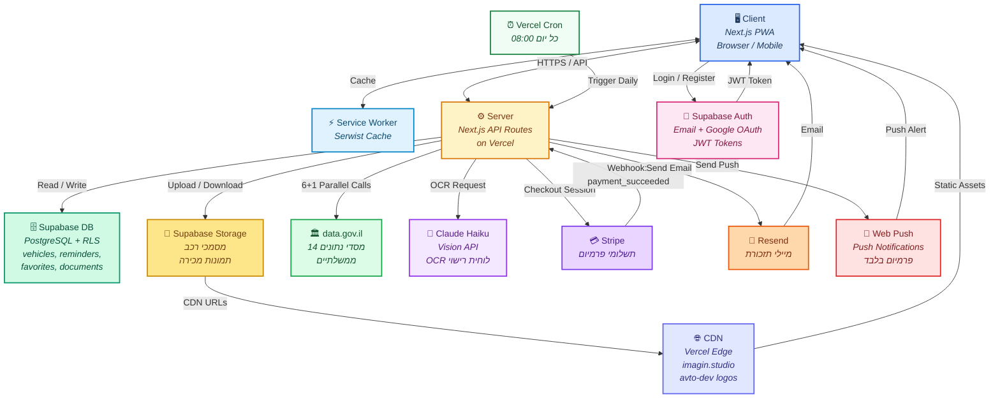
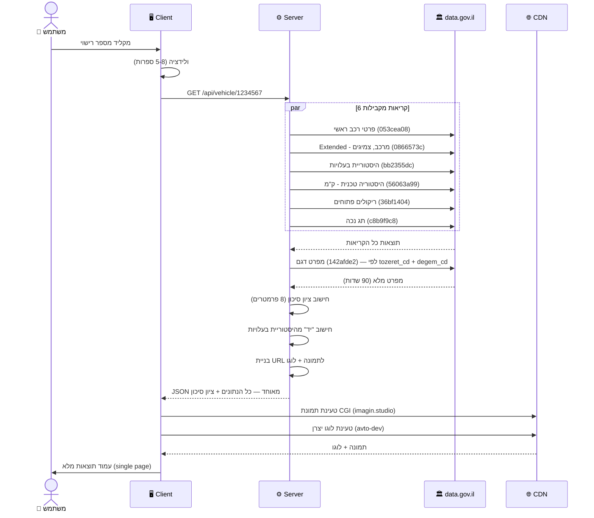
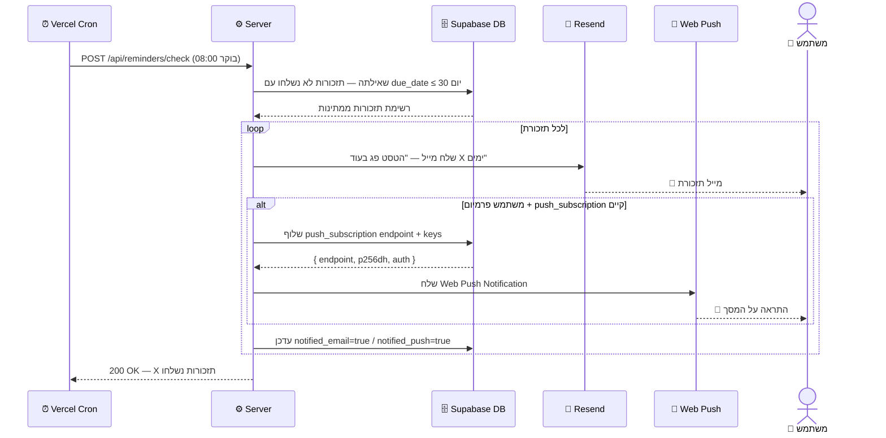
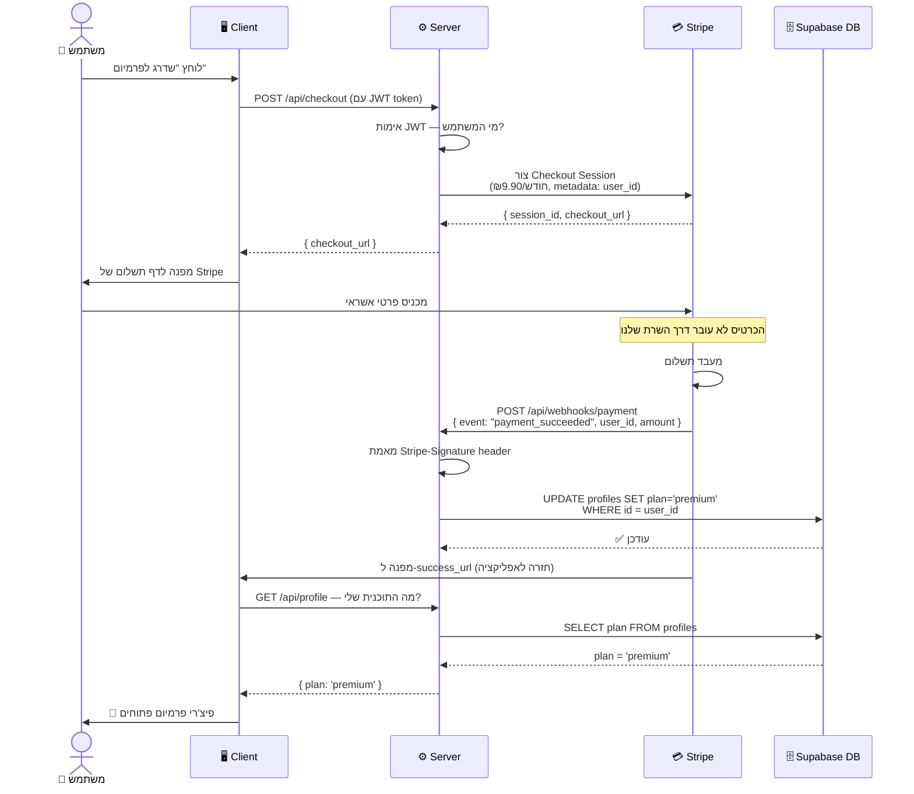

# MyCarPortal — System Design (שלב 3)

---

## רכיבי המערכת ואחריותם

| רכיב | טכנולוגיה | תפקיד באפליקציה |
|---|---|---|
| **Client** | Next.js 15 (Browser / PWA) | מציג תוצאות חיפוש, דשבורד, טפסים. שולח בקשות לשרת. עובד אופליין עם Service Worker. |
| **Server** | Next.js API Routes (Vercel) | Proxy לכל קריאות ה-API החיצוניות, חישוב ציון סיכון, לוגיקה עסקית, אימות בקשות. |
| **Database** | Supabase PostgreSQL + RLS | שמירת פרופילים, רכבים, תזכורות, מועדפים, היסטוריית טיפולים, מסמכים. RLS מגן שכל משתמש רואה רק את הנתונים שלו. |
| **Authentication** | Supabase Auth | הרשמה/התחברות (email + Google). מנפיק JWT token שמצורף לכל בקשה. |
| **File Storage** | Supabase Storage | אחסון מסמכי רכב (רישיון, ביטוח, קבלות). גישה מוגנת לפי user_id. |
| **CDN** | Vercel Edge + imagin.studio + avto-dev | Vercel מגיש assets סטטיים. imagin.studio מגיש תמונות CGI של רכבים. avto-dev מגיש לוגו יצרנים (SVG). |
| **Cache** | Serwist (Service Worker) | Network First לנתוני API (TTL שעה), Cache First לאסטים סטטיים (TTL 30 יום). |
| **Third-Party: data.gov.il** | CKAN REST API | 6+1 קריאות מקבילות לכל חיפוש — פרטי רכב, היסטוריית בעלויות, ק"מ, ריקולים, תג נכה, מפרט דגם. |
| **Third-Party: Claude Haiku** | Anthropic Vision API | OCR לזיהוי לוחית רישוי מצילום. |
| **Third-Party: Stripe** | Payments API + Webhooks | עיבוד תשלומים לפרמיום. Webhook מודיע לשרת כשתשלום הצליח. |
| **Notifications** | Resend (email) + web-push | Resend שולח מיילי תזכורת. web-push + VAPID שולח Push למשתמשי פרמיום. |
| **Scheduler** | Vercel Cron | מפעיל בדיקת תזכורות כל יום ב-08:00. |

---

## Architecture Diagram

---

## Flow 1: חיפוש רכב לפי מספר רישוי

### שלבי הזרימה

1. **הקלדה + ולידציה** — המשתמש מקליד מספר רישוי. ה-Client בודק פורמט (`^\d{5,8}$`) ומציג Loading skeleton.
2. **בקשה לשרת** — Client שולח `GET /api/vehicle/[plate]`. השרת הוא Proxy — ה-Client לא מדבר ישירות עם data.gov.il.
3. **6 קריאות מקבילות** — השרת שולח `Promise.all` עם 6 בקשות בו-זמנית ל-data.gov.il: פרטי רכב ראשי, Extended (מרכב/צמיגים), היסטורית בעלויות, היסטוריה טכנית (ק"מ/שינויים), ריקולים פתוחים, תג נכה.
4. **קריאה 7 תלויה** — לאחר תוצאה מקריאה 1, השרת שולח קריאה נוספת למפרט הדגם (לפי `tozeret_cd` + `degem_cd`).
5. **עיבוד ב-Server** — חישוב ציון סיכון (8 פרמטרים), חישוב "יד", בניית URL לתמונה (imagin.studio) ולוגו (avto-dev).
6. **תגובה ל-Client** — השרת מחזיר JSON מאוחד. Client מרנדר עמוד אחד עם כל הסקשנים.

### Sequence Diagram

---

## Flow 2: תזכורת טסט אוטומטית

### שלבי הזרימה

1. **Cron מופעל** — Vercel Cron מפעיל בכל יום ב-08:00 בקשה ל-`/api/reminders/check`.
2. **שליפת תזכורות** — השרת שואל את Supabase DB: "אילו תזכורות לא נשלחו עדיין, ו-`due_date` שלהן הוא בין היום ל-30 יום מעכשיו?"
3. **לכל תזכורת — שליחת אימייל** — השרת קורא ל-Resend API עם פרטי התזכורת. זמין לכל המשתמשים (חינם + פרמיום).
4. **לפרמיום — שליחת Push** — השרת בודק אם למשתמש יש `push_subscription` ב-DB. אם כן — שולח Push Notification דרך web-push + VAPID.
5. **עדכון DB** — השרת מסמן את התזכורת כ-`notified_email = true` / `notified_push = true` כדי לא לשלוח שוב.
6. **הודעה מגיעה** — המשתמש מקבל מייל / Push עם "הטסט של הרכב שלך פג בעוד 30 יום".

### Sequence Diagram

---

## Flow 3: רכישת מנוי פרמיום

### שלבי הזרימה

1. **לחיצה על "שדרג לפרמיום"** — Client שולח בקשה לשרת ליצור Checkout Session.
2. **יצירת Session ב-Stripe** — השרת יוצר session עם פרטי התוכנית (₪9.90/חודש) ו-`user_id` כ-metadata.
3. **הפניה ל-Stripe** — השרת מחזיר URL. Client מפנה המשתמש לדף תשלום של Stripe.
4. **השלמת תשלום** — המשתמש מכניס פרטי אשראי ישירות לדף Stripe (פרטי הכרטיס לא עוברים דרך השרת שלנו).
5. **Webhook מ-Stripe** — Stripe שולח HTTP POST ל-`/api/webhooks/payment` עם אירוע `payment_succeeded`.
6. **אימות + עדכון** — השרת מאמת חתימת Webhook (להגנה מזיופים), ואז מעדכן את `profiles.plan = 'premium'` ב-Supabase DB.
7. **Client מרוענן** — המשתמש מועבר חזרה לאפליקציה ורואה את הפיצ'רים הפרמיום פתוחים.

### Sequence Diagram

---

## סיכום הארכיטקטורה

| עיקרון | איך מיושם ב-MyCarPortal |
|---|---|
| **Never trust the Client** | כל קריאות ל-data.gov.il עוברות דרך API Routes בשרת — הקליינט לא מדבר ישירות |
| **Security** | RLS ב-Supabase, JWT validation בכל בקשה, Webhook signature verification |
| **Performance** | 6 קריאות מקבילות (`Promise.all`), Serwist cache, CDN לתמונות ולוגו |
| **Scalability** | Vercel ו-Supabase מטפלים ב-Load Balancing אוטומטית |
| **Separation of concerns** | Client = תצוגה בלבד, Server = לוגיקה + אבטחה, DB = נתונים |
